```{r setup, include=FALSE}
knitr::opts_chunk$set(echo = TRUE)
```
[Return to Homepage](../index.html)

# **About Me (Erick)**
I am a senior bioinformatics major studying at Utah Valley University. I am currently in the process of applying for graduate school and interested in programs focused on biomedical or health informatics. My hope is to continue exploring research at the government level attempting to better the general welfare of the public through agencies such as the FDA, USDA, or the CDC. Although I do love data analysis, my passion truly revolves around biological sciences. I love, love, love biology, especially the intricacies surrounding synthetic and molecular biology. In line with this passion is my love for science communication and education; nothing better than talking people's ear off about something you love! The dream career really would be a government scientist by day and an adjunct professor with bad Rate My Professor ratings by night but one can only dream.

Enough about that; below is a compilation of the different research I've been involved in and other miscellaneous adventures.

# **iGEM Research Lab**
Under Dr. Eric Domyan and Dr. Colleen Hough, I've been privileged to work on the transformation of a green algae in attempt to mitigate its production of nitrous oxide and increase its uptake of phosphate. The goal is to create a non-toxic tertiary treatment that could be used on agricultural runoff and in water treatment plants to convert nitrates into atmospheric nitrogen and sequester phosphate within the algae's cells. Our hope is that we can remove the essential nutrients that the algal blooms residing in Utah Lake (or any body of water) use to survive. The project was submitted under the title of Bloom Buster for judging and presentation at the 2024 iGEM (International Genetically Engineered Machine) conference in Paris, France; our team of 15 undergraduate students visited the conference.

For details regarding our project, [visit our iGEM page](https://2024.igem.wiki/uvu-utah-2/index.html) describing the whole process, including our experimental design, lab notebooks, outreach events, results, modeling, and more! 

## Photos from the conference
Group photo of the 2024 iGEM Grand Jamboree held in Paris, France, where over 4,500 students making up 400 teams from 50+ countries showcased and competed for synthetic biology glory. You can see us slightly to the left in the middle front of the photo! 

```{r, echo = FALSE, out.width = "100%"}
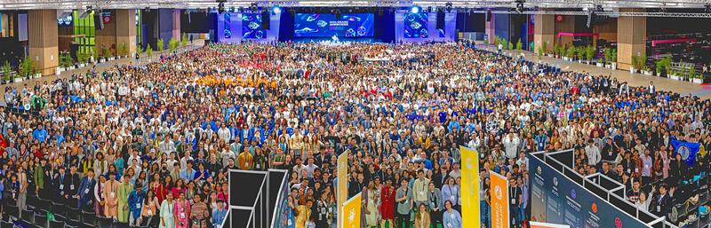
```


The Bloom Busters (Eric Domyan and Colleen Hough in the lower right and left corners, respectively) at the main stage:

```{r, echo = FALSE, out.width = "100%"}
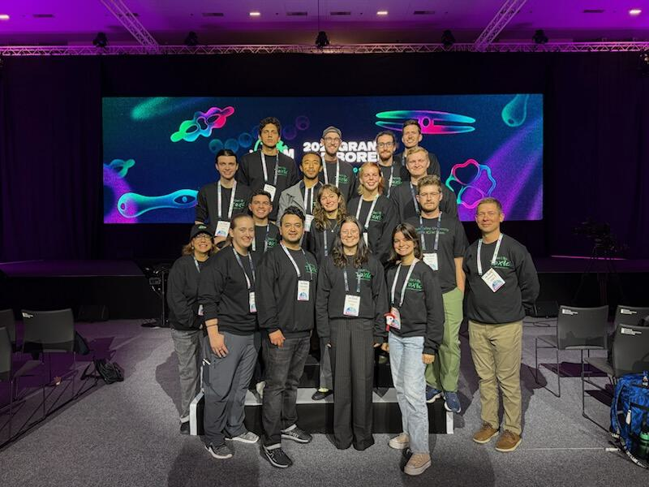
```


Myself (Erick) and Matthew Harris presenting the Bloom Buster project during tabling at the conference:

```{r, echo = FALSE, out.width = "100%"}
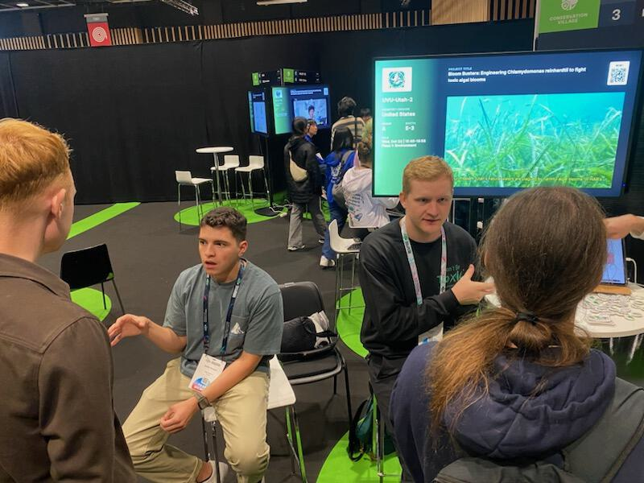
```


Beautiful photo of the Eiffel Tower (credit to Elise Bennett):

```{r, echo = FALSE, out.width = "100%"}
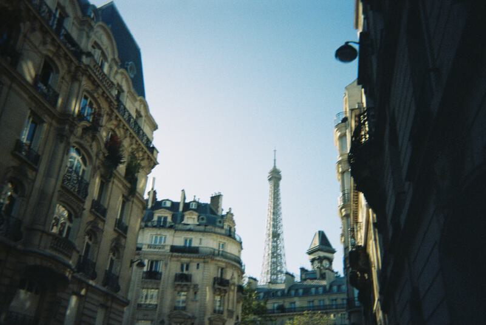
```

# **Cummings Lab**
As an NSF-funded research intern, I spent the summer of 2024 visiting and working under Dr. Michael Cummings at the Institute for Advanced Computer Studies at the University of Maryland (College Park, MD). It was here that I got my first real taste of what it would be like to work in a PhD-level dry lab. While the lab itself emphasized research in pure computational biology and genomics, our work was clinically driven. Another intern (Ryan Schuenke) and myself, alongside PhD-canidate Yi Chen, worked on predicting patient treatment outcomes from a series of substance-use disorder treatment facilities called Tuerk House Inc. based in Baltimore, MD. The data consisted of thousands of records, across 8,000 patients over 3 years and variety of information ranging from drug of choice, time spent at the facilities, and racial, sex, and familial demographics. We initially attempted network analysis on the data set hoping we could find the most efficient path of successful treatment, however, we ran into the main pitfall of poorly recorded time records. Our main contributions were our detailed tidying of the data set, our analysis on non-substance use disorder services offered to the general public, and algorithmic approaches to quantifying "discharge to" and "referral from" locations to offer and start and end location of the patients. As the research is still being conducted by Yi and Dr. Cummings, I will not be posting anything related to the exact details of the R code we wrote. 

## Photos from Maryland 
The 2024 BRiDGe REU cohort in front of the IRB at the University of Maryland:

```{r, echo = FALSE, out.width = "100%"}
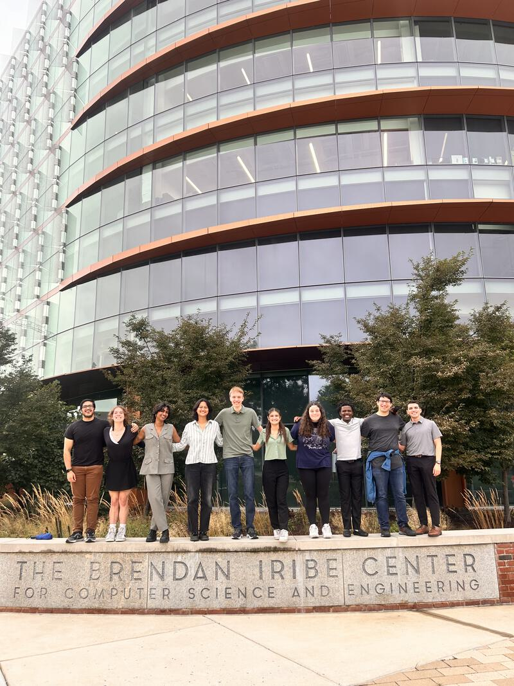
```


Some of the cohort celebrating 4th of July in the nation's capital:

```{r, echo = FALSE, out.width = "100%"}
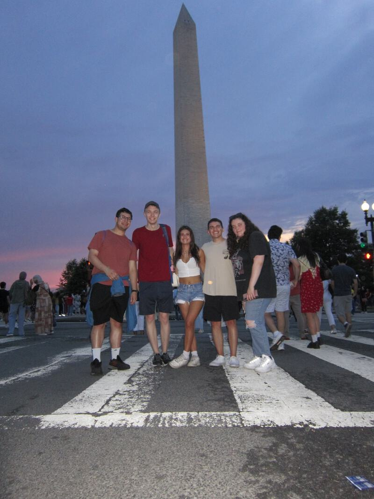
```

# **Hjelmen Lab**
Under Dr. Carl Hjelmen, I have been undertaking my own independent research project on extremophile insects (specifically flies) and the correlation to genome size in comparison to other extremophiles and "standard" insects. I've conceptualized the project and have done background research, collected samples from the shores of the Great Salt Lake, and spent the last month curating the species and sex of the flies. The next step: to conduct flow cytometry for genome size estimation and sequence the whole genome of the flies. 

## Photo of brine flies 
A microscopic image of the flies assumed to be of the species Ephydra gracilis:

```{r, echo = FALSE, out.width = "100%"}
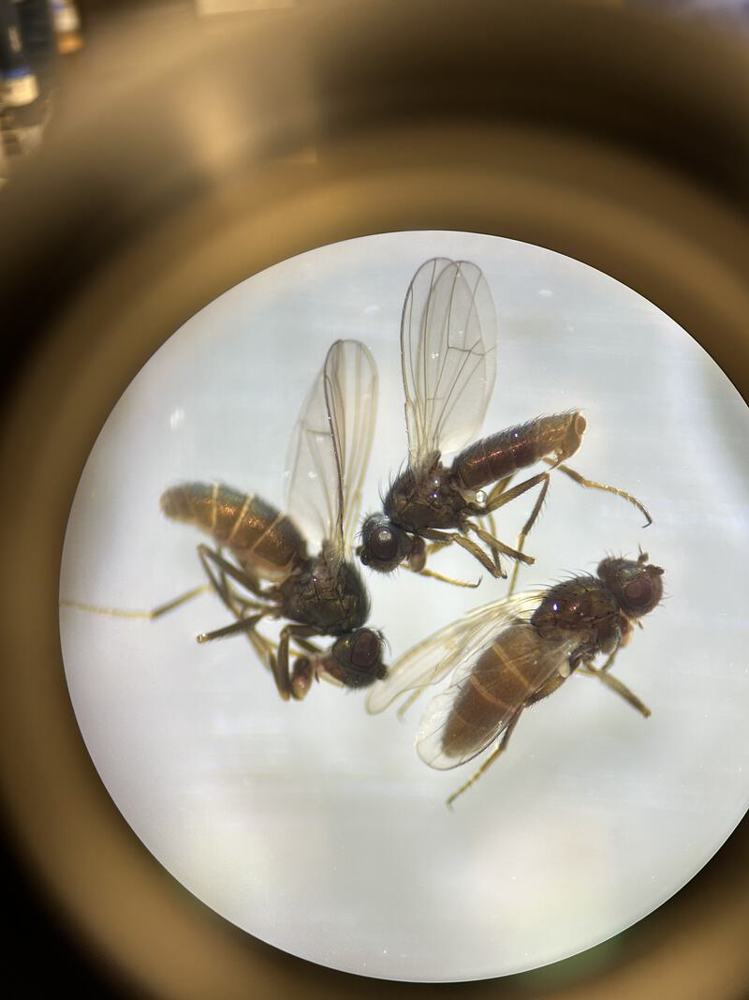
```

# **Misc. Adventures**
Presenting the basics of synthetic biology to concurrent enrollment high school students at UVU:

```{r, echo = FALSE, out.width = "100%"}
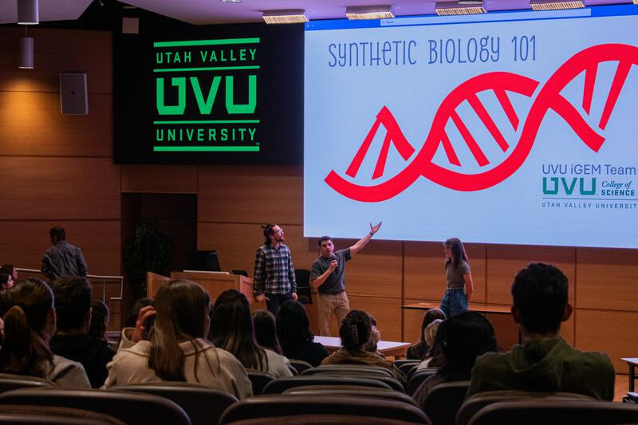
```


Teaching students about genetic engineering at American Fork High School:

```{r, echo = FALSE, out.width = "100%"}
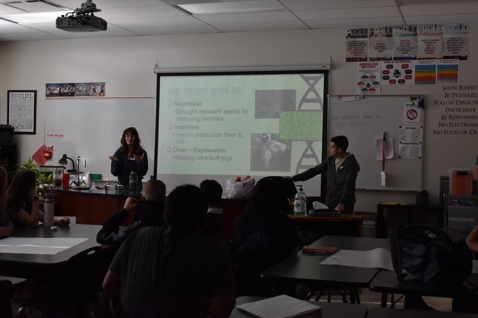
```


Representing the biotechnology program at UVU's Science Night: 

```{r, echo = FALSE, out.width = "100%"}
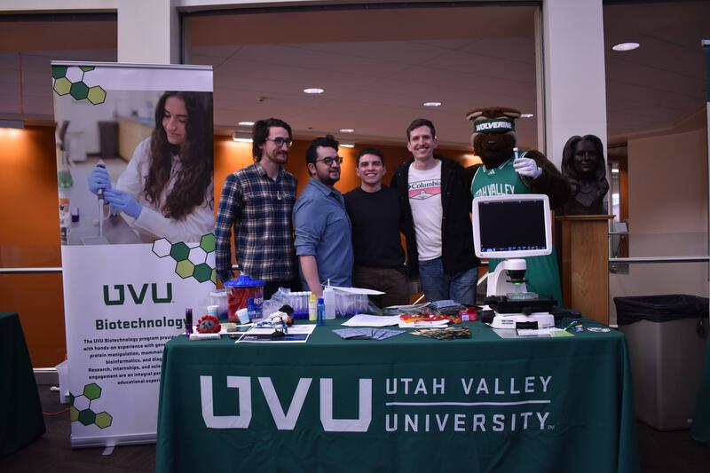
```


Gerardo Acosta, myself (Erick), and Elise Bennett exploring Paris way too late in the night: 

```{r, echo = FALSE, out.width = "100%"}
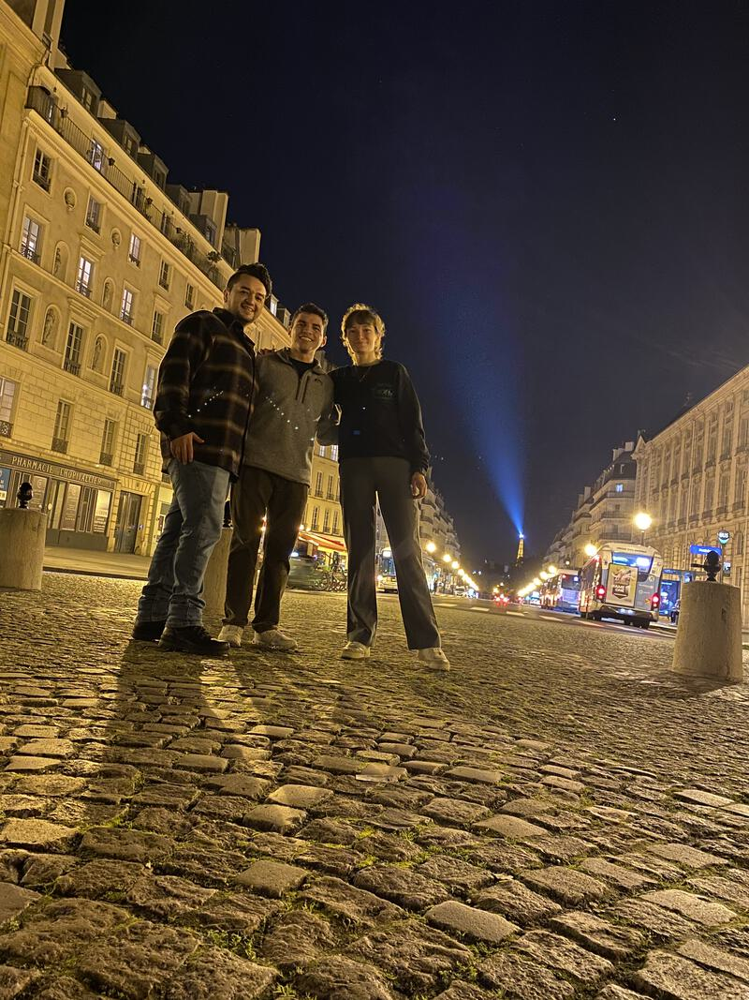
```

[Return to Homepage](../index.html)